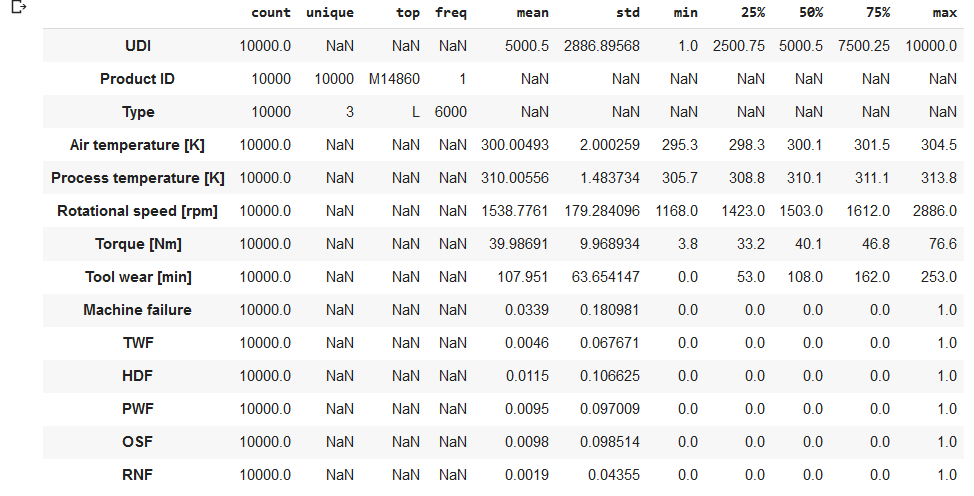
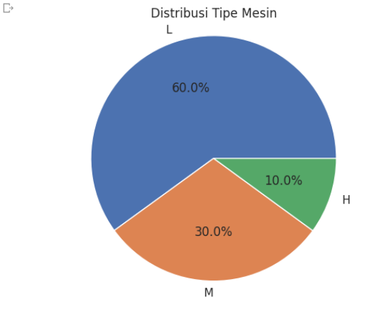
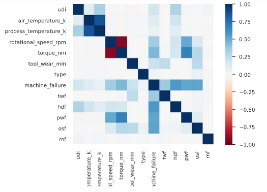
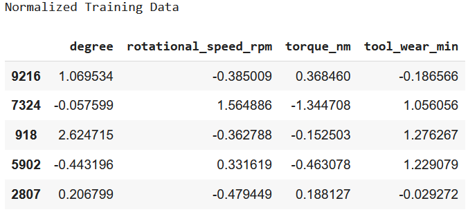
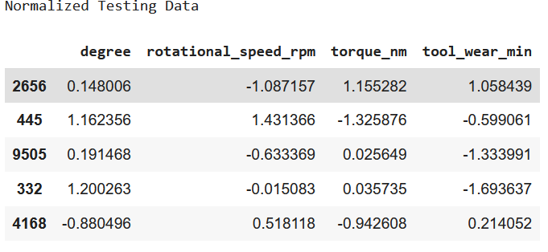
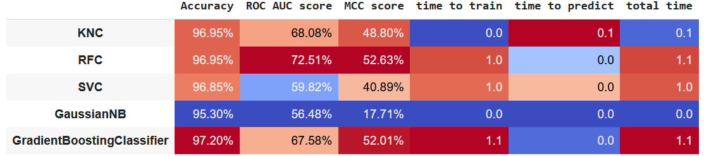

# Laporan Proyek Machine Learning - Sukron Chafidhi


Source by <a href="https://www.freepik.com/free-photo/worker-operating-industrial-machine-metal-workshop_11035743.htm#query=milling%20machine&position=29&from_view=search&track=ais">Image by aleksandarlittlewolf</a> on Freepik


## Domain Proyek

Mesin *Milling* sangat sering ditemukan pada dunia industri. Mesin ini biasanya digunakan untuk mengurangi material dari sebuah benda kerja menggunakan *rotary cutters*. Mesin ini mencakup proses *drilling, boring* dan *cut* yang dapat dikombinasikan untuk membentuk suatu *part*. [[1]](#ref-1).

Semua mesin pasti terdapat kemungkinan untuk rusak, sehingga diperlukan *maintenance*. *Predictive Maintenance* meningkatkan kualitas dan keandalan manufaktur dibandingkan dengan *Preventive Maintenance* [[2](#ref-2)]. *Preventive maintenace* merupakan perawatan yang dilakukan secara rutin terhadap mesin untuk mencegah mesin rusak dikemudian hari, sementara *Predictive Maintenance* dilakukan dengan cara memonitoring kinerja dari dari mesin melalui sensor-sensor dengan tujuan untuk mendeteksi masalah pada mesin dan mencegah kegagalan mesin (rusak), sehingga mesin dapat dihentikan sementara untuk mencegah cacat produk[[3](#ref-3)]. Hal tersebutlah yang menjadi sebab diperlukannya *Predictive Maintenance* pada mesin *Milling* sehingga *part* yang diproses dengannya tidak mengalami cacat karena kegagalan mesin.

## Business Understanding

### Problem Statements

Menjelaskan pernyataan masalah latar belakang:
- Fitur apa yang paling berpengaruh terhadap kegagalan mesin (machine failure)?
- Bagaimana kondisi mesin saat menerima input dari sensor dengan nilai tertentu?

### Goals

Menjelaskan tujuan dari pernyataan masalah:
- Mengetahui fitur yang paling berkorelasi dengan gagal atau tidak nya mesin
- Membuat model machine learning yang dapat memprediksi kapan saat mesin untuk gagal

### Metodologi
Mengetahui kapan akan terjadinya kegagalan mesin merupakan tujuan yang ingin dicapai, guna mencegah terjadinya kerusakan mesin yang lebih parah dan akan memakan lebih banyak waktu dan biaya. Oleh karena itu, perlu diketahui kapan terjadinya kegagalan ketika masing-masing sensor mengirimkan nilai ke model dengan output berupa pilihan antara mesin berjalan normal ataupun gagal. Oleh karena nilai dari kegagalan bersifat diskrit atau kategorikal sehingga permasalahan dapat diselesaikan dengan cara klasifikasi.

### Metrik
Metrik yang akan digunakan untuk kasus klasifikasi ini yaitu *accuracy*, *ROC AUC score* dan MCC. *accuracy* merupakan rasio antara jumlah prediksi yang benar dan total prediksi yang dilakukan, *ROC AUC score* merupakan nilai yang berada dibawah kurva TPR(*true positive rate*) - FPR (*false positive rate*) dan MCC merupakan koefisien korelasi yang menggambarkan sejauh mana hubungan antara hasil klasifikasi yang teramati dengan hasil klasifikasi yang diprediksi [[4](#ref-4)].
 Source by [[4](#ref-4)]

 Source by [[4](#ref-4)]

 source by [[6](#ref-6)]

## Data Understanding

Data yang digunakan merupakan data dari *kaggle* yang berisi tentang catatan terkait sensor-sensor pada mesin *milling* disertai kegagalan dan jenis-jenisnya [Predictive Maintenance Dataset (AI4I 2020)](https://www.kaggle.com/datasets/stephanmatzka/predictive-maintenance-dataset-ai4i-2020).

### Variabel-variabel pada *Predictive Maintenance* dataset adalah sebagai berikut:
1.   UID: unique identifier ranging from 1 to 10000
2.   Product ID: consisting of a letter L, M, or H for low (50% of all products), medium (30%) and high (20%) as product quality variants and a variant-specific serial number
3.   Type: just the product type L, M or H from column 2
4.   Air temperature [K]: generated using a random walk process later normalized to a standard deviation of 2 K around 300 K
5.   Process temperature [K]: generated using a random walk process normalized to a standard deviation of 1 K, added to the air temperature plus 10 K.
6.  Rotational speed [rpm]: calculated from a power of 2860 W, overlaid with a normally distributed noise
7.  Torque [Nm]: torque values are normally distributed around 40 Nm with a SD = 10 Nm and no negative values.
8.  Tool wear [min]: The quality variants H/M/L add 5/3/2 minutes of tool wear to the used tool in the process.
9.  A 'machine failure' label that indicates, whether the machine has failed in this particular datapoint for any of the following failure modes are true.

Kondisi kegagalan mesin dibagi menjadi 5 yaitu.
1. tool wear failure (TWF): the tool will be replaced of fail at a randomly selected tool wear time between 200 - 240 mins (120 times in our dataset). At this point in time, the tool is replaced 69 times, and fails 51 times (randomly assigned).
2. heat dissipation failure (HDF): heat dissipation causes a process failure, if the difference between air- and process temperature is below 8.6 K and the tools rotational speed is below 1380 rpm. This is the case for 115 data points.
3. power failure (PWF): the product of torque and rotational speed (in rad/s) equals the power required for the process. If this power is below 3500 W or above 9000 W, the process fails, which is the case 95 times in our dataset.
4. overstrain failure (OSF): if the product of tool wear and torque exceeds 11,000 minNm for the L product variant (12,000 M, 13,000 H), the process fails due to overstrain. This is true for 98 datapoints.
5. random failures (RNF): each process has a chance of 0,1 % to fail regardless of its process parameters. This is the case for only 5 datapoints, less than could be expected for 10,000 datapoints in our dataset. 

### Informasi Dataset
```
<class 'pandas.core.frame.DataFrame'>
RangeIndex: 10000 entries, 0 to 9999
Data columns (total 14 columns):
 #   Column                   Non-Null Count  Dtype  
---  ------                   --------------  -----  
 0   UDI                      10000 non-null  int64  
 1   Product ID               10000 non-null  object 
 2   Type                     10000 non-null  object 
 3   Air temperature [K]      10000 non-null  float64
 4   Process temperature [K]  10000 non-null  float64
 5   Rotational speed [rpm]   10000 non-null  int64  
 6   Torque [Nm]              10000 non-null  float64
 7   Tool wear [min]          10000 non-null  int64  
 8   Machine failure          10000 non-null  int64  
 9   TWF                      10000 non-null  int64  
 10  HDF                      10000 non-null  int64  
 11  PWF                      10000 non-null  int64  
 12  OSF                      10000 non-null  int64  
 13  RNF                      10000 non-null  int64  
dtypes: float64(3), int64(9), object(2)
memory usage: 1.1+ MB
```
Informasi yang didapat dari hasil diatas antara lain:

*   Terdapat 2 kolom dengan tipe object, yaitu: Product ID, dan Type. Kolom ini merupakan categorical features (fitur non-numerik).
*   Terdapat 9 kolom bertipe Int64, yaitu: UDI, Rotational speed [rpm], Tool wear [min], Machine failure, TWF, HDF, PWF, OSF, dan RNF. Kolom UDI merupakan identifier unik untuk masing-masing sensor, sementara Rotational speed [rpm], Tool wear [min] merupakan fitur numerik hasil dari pengukuran sensor, dan Machine failure merupakan target yang ingin diprediksi dengan Failure Category antara lain TWF, HDF, PWF, OSF, dan RNF namun pada kali ini tidak akan menggunakan kategori tersebut.
*  Terdapat 3 kolom bertipe Float, yaitu: Air temperature [K], Process temperature [K] dan Torque [Nm]. Kolom tersebut merupakan fitur numerik hasil pembacaan sensor.

### Analisis Deskriptif
Karena tipe data masih bercampur, antara int64 dan float untuk data number, maka perlu dijadikan satu format menjadi float untuk seluruh data number. Sementara itu, penamaan kolom masih mengandung spasi dan tanda lain, sehingga akan saya rubah spasi dan karakter spesial dengan *underscore* untuk mempermudah pemanggilan kelas.Berikut merupakan hasil derskriptif statistik untuk semua data number.

Hasil analisis
- mean dari *machine failure* berjumlah 0.03390 yang menandakan bahwa data terkait jumlah kegagalan lebih sedikit dari pada data saaat mesin berjalan normal, karena nilai hanya berupa 1 atau 0.
- karena jumlah data terlalu berbeda jauh menandakan data *imbalanace*.
- data berjumlah 10.000


### Cek Missing Value
Jika memang terdapat missing value pada data akan kita tangani, untuk mengecek missing value per fitur kita menggunakan fungsi data.isnull().sum().
```
Cek data duplikat: 
Jumlah data duplikat:  0


Cek missing value

udi                      0
product_id               0
type                     0
air_temperature_k        0
process_temperature_k    0
rotational_speed_rpm     0
torque_nm                0
tool_wear_min            0
machine_failure          0
twf                      0
hdf                      0
pwf                      0
osf                      0
rnf                      0
dtype: int64
```

Informasi diatas memberikan kesimpulan bahwa tidak terdapat *missing value* pada data.

### Visualization
Berikut merupakan rasio per tipe produk.


Sementara itu, hubungan korelasi antar fitur pada dataset sebagai berikut..


Dapat diketahui bahwa fitur yang memiliki nilai korelasi dibawah 0.05 salah satunya yaitu Type. Sehingga akan dihapus, sementara itu, karena kita hanya mencari kondisi mesin tanpa kategori dari kegagalannya, sehingga TWF, HDF, PSF dan OSF juga akan dihapus. Selain itu, karena Product Id dan UDI hanya berupa penamaan unik untuk mesin, maka kolom tersebut juga akan dihapus. Potongan kode untuk menghapus kolom tersebut sebagai berikut.
```
data.drop(['udi', 'product_id', 'twf','hdf','pwf','osf','rnf', 'type'],axis=1,inplace=True)

```

## Data Preparation
Teknik yang digunakan pada dataset adalah sebagai berikut.
- Karena fitur kategorikal machine_failure telah terformat dengan benar (1 atau 0) sehingga tidak perlu melakukan *Encoding* kategori
- Reduksi variabel dengan PCA
- Pembagian dataset ke train dan test
- Normalisasi

Proses normalisasi dilakukan setelah *splitting* untuk mencegah informasi bocor [[5](#ref-5)]

Untuk melakukan normalisasi menggunakan kode berikut.
```
# mereduksi fitur
from sklearn.decomposition import PCA
pca = PCA(n_components=1, random_state=123)
pca.fit(data[['air_temperature_k','process_temperature_k']])
data['degree'] = pca.transform(data.loc[:, ('air_temperature_k','process_temperature_k')]).flatten()
data.drop(['air_temperature_k','process_temperature_k'], axis=1, inplace=True)
```
kode diatas akan menggabungkan fitur air_temperature_k dan process_temperature_k menjadi fitur baru bernama degree.

*Train Test Split* dilakukan menggunakan kode dibawah inil.
```
from sklearn.model_selection import train_test_split

X = df.drop(["machine_failure"],axis =1)
y = df["machine_failure"]
X_train, X_test, y_train, y_test = train_test_split(X, y, test_size = 0.2, random_state = 2939)
```
Hasil dari *splitting* tersebut antara lain berikut.
```
Total # of sample in whole dataset: 10000
Total # of sample in train dataset: 8000
Total # of sample in test dataset: 2000
```

Selanjutnya adalah normalisasi dengan fungsi StandardScaler, menggunakan potongan kode berikut.
```
# Normalisasi data
from sklearn.preprocessing import StandardScaler

scaler = StandardScaler()

# Normalize Training Data
scaler.fit(X_train[numerical_features])
X_train[numerical_features] = scaler.transform(X_train.loc[:, numerical_features])
print('Normalized Training Data\n')
X_train[numerical_features].head()
```

```
# Normalize Testing Data
scaler.fit(X_test[numerical_features])
X_test[numerical_features] = scaler.transform(X_test.loc[:, numerical_features])
print('Normalized Testing Data\n')
X_test[numerical_features].head()
```

Hasil normalisasi sesuai tabel berikut.




## Modeling
Pada tahap ini akan dikembangkan model *machine learning* untuk data menggunakan algoritma KNN, *Random Forest*, *Support Vector Machine*, *Gaussian Naive Bayes*, dan *GradientBoosting*. Sebelum membuat model, terlebih dahulu kita membuat sebuah dataframe untuk menyimpan nilai matrik dan function untuk pelatihan model.
```
# Siapkan dataframe untuk analisis model
import time
model_performance = pd.DataFrame(columns=['Accuracy', 'ROC AUC score','MCC score','time to train','time to predict','total time'])
list(model_performance)
```

```
# funsi untuk training sekaligus menyimpan nilai metrik
def train_model(algorith, algorith_name, x_train, x_test, y_train):
  %time
  start = time.time()
  model = algorith.fit(x_train, y_train)
  end_train = time.time()
  y_predictions = model.predict(x_test)
  end_predict = time.time()

  accuracy = accuracy_score(y_test, y_predictions)
  MCC = matthews_corrcoef(y_test, y_predictions)
  ROC_AUC = roc_auc_score(y_test, y_predictions, average='weighted')

  print("Accuracy: "+ "{:.2%}".format(accuracy))
  print("MCC: "+ "{:.2%}".format(MCC))
  print("ROC AUC score: "+ "{:.2%}".format(ROC_AUC))
  print("time to train: "+ "{:.2f}".format(end_train-start)+" s")
  print("time to predict: "+"{:.2f}".format(end_predict-end_train)+" s")
  print("total: "+"{:.2f}".format(end_predict-start)+" s")
  model_performance.loc[algorith_name] = [accuracy, ROC_AUC,MCC,end_train-start,end_predict-end_train,end_predict-start]
```

### KNeighborsClassifier
Metode ini didasarkan pada k-nearest neighbors (k-NN) dari sebuah sampel yang perlu diklasifikasikan. Angka 'k' adalah nilai integer yang ditentukan oleh pengguna. Ini adalah salah satu jenis klasifikasi yang paling umum digunakan dari kedua algoritma tersebut [[7](#ref-7)].
```
from sklearn.metrics import mean_squared_error
from sklearn.neighbors import KNeighborsClassifier

knc = KNeighborsClassifier(n_neighbors = 5, metric = 'minkowski', p = 2)

train_model(algorith=knc, algorith_name='KNC', x_train=X_train, x_test=X_test, y_train=y_train)
```

### RandomForestClassifier
 Random forest adalah sebuah metode estimasi yang menggunakan beberapa klasifikasi pohon keputusan pada sub-sampel dataset yang berbeda untuk meningkatkan akurasi prediksi dan mengontrol over-fitting. Ukuran sub-sampel dikendalikan oleh parameter max_samples jika bootstrap=True (default), jika tidak, seluruh dataset digunakan untuk membangun setiap pohon [[8](#ref-8)].
```
from sklearn.ensemble import RandomForestClassifier

rfc = RandomForestClassifier()
train_model(algorith=rfc, algorith_name='RFC', x_train=X_train, x_test=X_test, y_train=y_train)
```
### Support Vector Classification
Support Vector Machines (SVM) adalah algoritma pembelajaran mesin yang digunakan untuk klasifikasi dan regresi. SVM merupakan salah satu algoritma pembelajaran mesin yang kuat untuk klasifikasi, regresi, dan deteksi outlier. SVM membangun model yang membagi titik data baru ke dalam kategori yang telah ditentukan. Oleh karena itu, SVM dapat dianggap sebagai pengklasifikasi linier biner non-probabilistik [[9](#ref-9)].

```
from sklearn.svm import SVC

svc = SVC(probability=True)

train_model(algorith=svc, algorith_name='SVC', x_train=X_train, x_test=X_test, y_train=y_train)
```
### GaussianNB
Klasifikasi Gaussian Naïve Bayes mengasumsikan bahwa data dari setiap label berasal dari distribusi Gaussian yang sederhana. Scikit-learn menyediakan sklearn.naive_bayes.GaussianNB untuk mengimplementasikan algoritma Gaussian Naïve Bayes dalam klasifikasi [[10](#ref-10)]. Distribusi normal, yang juga disebut sebagai distribusi Gaussian, merupakan distribusi probabilitas yang menunjukkan sifat simetri terhadap nilai rata-rata. Distribusi ini mengindikasikan bahwa data yang mendekati nilai rata-rata memiliki kemungkinan muncul yang lebih tinggi dibandingkan dengan data yang berjarak jauh dari nilai rata-rata. [[11](#ref-11)].

```
from sklearn.naive_bayes import GaussianNB

gnb = GaussianNB()

train_model(algorith=gnb, algorith_name='GaussianNB', x_train=X_train, x_test=X_test, y_train=y_train)
```

### GradientBoostingClassifier
Klasifikasi gradient boosting merujuk pada sekelompok algoritma pembelajaran mesin yang menggabungkan beberapa model pembelajaran yang lemah untuk membentuk sebuah model prediksi yang kuat. Biasanya, dalam metode gradient boosting ini, digunakan pohon keputusan sebagai salah satu komponen utamanya. Popularitas model gradient boosting meningkat karena kemampuannya dalam mengklasifikasikan dataset yang rumit dan baru-baru ini berhasil meraih kemenangan dalam beberapa kompetisi ilmu data di platform Kaggle [[12](#ref-12)].

```
from sklearn.ensemble import GradientBoostingClassifier

boosting = GradientBoostingClassifier(learning_rate=0.05, random_state=55)

train_model(algorith=boosting, algorith_name='GradientBoostingClassifier', x_train=X_train, x_test=X_test, y_train=y_train)
```

## Evaluation
Model yang digunakan adalah klasifikasi biner dengan metrik evaluasi sebagai berikut.
- accuracy
- ROC AUC score
- MCC

### Accuracy
Merupakan nilai yang didapatlan dari pembagian dari jumlah prediksi yang benar dengan jumlah total prediksi dengan rentang 0-1 atau diubah ke persentase 0-100%.


Source by [[4](#ref-4)]

Metrik akurasi memiliki keterbatasan dimana ketika digunakan untuk data Imbalance maka dapat menimbulkan kesalahan [[6](#ref-6)].

Dari model yang telah kita buat, saya sengaja menambahkan akurasi untuk mencobanya pada data imbalance. Dari gambar dibawah dapat diketahui bahwa model dengan akurasi tertinggi adalah GradientBoostingClassifier, KNC dan RFC.


### ROC AUC
Kurva ROC sangat cocok digunakan untuk data yang imbalance. AUC merupakan nilai yang berada dibawah kurva TPR(*true positive rate*) - FPR (*false positive rate*) [[4](#ref-4)].


Source by [[4](#ref-4)]


dari gambar diatas dapat diketahui bahwa model dengan ROC AUC score tertinggi pada RFC, KNC dan GradientBoostingClassifier. 

### MCC(Matthews Correlation Coefficient)
MCC dikenal sebagai salah satu metode terkenal dalam menilai performa suatu model klasifikasi. Metrik ini berfungsi sebagai koefisien korelasi yang menggambarkan sejauh mana hubungan antara hasil klasifikasi yang teramati dengan hasil klasifikasi yang diprediksi. Rentang nilai MCC mirip dengan koefisien korelasi lainnya, yaitu antara -1,0 hingga +1,0. Apabila nilai MCC mencapai +1, hal ini menunjukkan bahwa model memiliki performa yang optimal atau sempurna [[6](#ref-6)].


source by [[6](#ref-6)]


dari gambar diatas dapat diketahui bahwa model dengan nilai MCC tertinggi adalah RFC, GradientBoostingClassifier dan KNC yang menandakan bahwa model bekerja cukup baik.

### Keputusan Pemilihan Model
Dari beberapa sumber yang telah saya jabarkan, ternyata grafik yang paling diandalkan dalam pemilihan performance dari model klasifikasi untuk data imbalance adalah MCC, sehingga prioritas untuk pemilihan matrik dari paling utama yaitu MCC, ROC AUC dan Accuracy. Dari semua model, model dengan nilai MCC tertinggi adalah model RFC dan ternyata diikuti dengan nilai ROC AUC yang tertinggi pula, sedangkan nilai Accuracy kemungkinan tidak terlalu dapat diandalkan untuk data imbalance ini dengan nilai yang cukup rendah yaitu 96,95%. Maka, model dengan performa terbaik yaitu RFC(RandomForestClassifier).

# Daftar Referensi
[1] *Mike*. (2020, Agustus 18). Milling Machines: What are They and What Do They Do?. Diakses dari https://dtsuk.co.uk/uncategorized/milling-machines-what-are-they-and-what-do-they-do. {#ref-1}

[2] *Hesser, D. F., & Markert, B*. (2019). Tool wear monitoring of a retrofitted CNC milling machine using artificial neural networks. Manufacturing letters, 19, 1-4. {#ref-2}

[3] *Mobley, R. Keith*. An introduction to predictive maintenance. Elsevier, 2002. {#ref-3}

[4] *Agrawal, Kumar Sumeet*. (2021, July 20). Metrics to Evaluate your Classification Model to take right decisions. Diakses dari https://www.analyticsvidhya.com/blog/2021/07/metrics-to-evaluate-your-classification-model-to-take-the-right-decisions. {#ref-4}

[5] *Tingle, Max*. (2019, November 2019). Preventing Data Leakage in Your Machine Learning Model. Diakses dari https://towardsdatascience.com/preventing-data-leakage-in-your-machine-learning-model-9ae54b3cd1fb. {#ref-5}

[6] *Vickery, Rebecca*. (2021, Desember 8). 8 Metrics to Measure Classification Performance. Diakses dari https://towardsdatascience.com/8-metrics-to-measure-classification-performance-984d9d7fd7aa. {#ref-6}

[7] *Klein, Bernd*. (2023, Juni 16). Diakses dari https://python-course.eu/machine-learning/k-nearest-neighbor-classifier-with-sklearn.php. {#ref-7}

[8] *Scikit-learn*. Diakses dari https://scikit-learn.org/stable/modules/generated/sklearn.ensemble.RandomForestClassifier.html. {#ref-8}

[9] *Banerjee, Prashant*. (2020). Diakses dari https://www.kaggle.com/code/prashant111/svm-classifier-tutorial. {#ref-9}

[10] *Tutorialpoint*. Diakses dari https://www.tutorialspoint.com/scikit_learn/scikit_learn_gaussian_naive_bayes.htm. {#ref-10}

[11] *Chen, James*. (2023, Maret 30). Diakses dari https://www.investopedia.com/terms/n/normaldistribution.asp. {#ref-11}

[12] *Nelson, Dan*. Diakse dari https://stackabuse.com/gradient-boosting-classifiers-in-python-with-scikit-learn. {#ref-12}