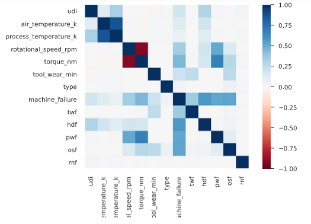

# Lporan Projek Machine Learning - Sukron Chafidhi


Source by <a href="https://www.freepik.com/free-photo/worker-operating-industrial-machine-metal-workshop_11035743.htm#query=milling%20machine&position=29&from_view=search&track=ais">Image by aleksandarlittlewolf</a> on Freepik


## Domain Projek

Prototipe 3D dan *manufaktur* (3DRPM) melibatkan penggunaan teknologi yang saling terhubung untuk menciptakan objek fisik secara langsung dari data CAD. Berbeda dengan mesin tradisional yang menghilangkan material berlebih, 3DRPM membangun objek secara bertahap melalui lapisan horizontal. Sistem ini juga disebut *solid freeform fabrication* dan *layered manufacturing*, yang menawarkan keuntungan dibandingkan dengan metode konvensional seperti *milling* atau *turning* (Pérès & Noyes, 2006).

1. Objek dapat diproduksi dengan kompleksitas geometri yang rumit tanpa memerlukan pengaturan mesin yang kompleks atau perakitan akhir.
2. Objek dapat dibangun menggunakan berbagai material, termasuk komposit, dan material dapat divariasikan secara terkendali di lokasi mana pun dalam objek.
3. Sistem *solid freeform fabrication* menyederhanakan konstruksi objek kompleks, menjadikannya proses yang terkelola, sederhana, dan relatif cepat.
4. Penggunaan *jig* dan *fixture* menjadi tidak diperlukan dalam pendekatan ini.

*Predictive Maintenance* (PM) adalah metode yang digunakan untuk memantau kondisi mesin guna mencegah kegagalan yang melibatkan biaya mahal dan melakukan perawatan hanya ketika diperlukan. Metode ini memiliki sejarah yang panjang, berkembang dari bentuk pemeriksaan visual awal menjadi teknik otomatisasi yang menggunakan pemrosesan sinyal lanjutan. Dalam praktik perawatan tradisional, terdapat pertimbangan *trade-off*, di mana harus memilih antara memaksimalkan umur komponen dan mengambil risiko *downtime* mesin (*run-to-failure*), atau memaksimalkan waktu operasi dengan mengganti suku cadang lebih awal, meskipun masih berfungsi (*time-based* PM). Namun, terbukti bahwa pendekatan berbasis waktu ini tidak efektif untuk sebagian besar komponen peralatan, karena memiliki cacat dan kurang dapat diandalkan dalam beberapa tahun terakhir (Mobley, 2022). PM bertujuan untuk meminimalkan perawatan dengan memprediksi kebutuhan sebelumnya, sehingga perusahaan dapat memaksimalkan masa pakai aset. Hal ini dicapai dengan mengurangi frekuensi perawatan, menghindari kerusakan mendadak, dan menghilangkan perawatan *preventif* yang tidak perlu. Akibatnya, waktu dan biaya yang signifikan dapat dihemat, serta keandalan sistem meningkat (Traini et al., 2019).

Untuk menerapkan strategi PM, diperlukan sistem *Condition Monitoring* (CM). CM melibatkan pemantauan satu atau lebih parameter mesin untuk mendeteksi potensi kerusakan pada tahap awal. Khususnya, dalam operasi mesin seperti *milling* dan *turning* yang menggunakan alat pemotong, pemantauan keausan alat sangat penting. Alat yang aus dapat berdampak negatif pada kualitas benda kerja dan berpotensi merusak sistem permesinan (Traini et al., 2021). Penilaian kondisi alat yang akurat mencegah penggunaan alat yang sudah aus, yang dapat menyebabkan penurunan kualitas kerja, peningkatan biaya, dan waktu produksi yang lebih lama akibat penggantian *preventif* yang berlebihan. Industri 4.0 menekankan digitalisasi mesin dan konektivitas, yang memungkinkan pemantauan kondisi yang lebih efektif. Hal ini dicapai melalui analisis data sensor, yang memberikan wawasan yang lebih baik tentang kondisi alat (Żabiński et al., 2019). Dari berbagai penjelasan tersebut, dapat dipahami bahwa PM sangat penting untuk mesin *milling* karena berfungsi untuk mencegah kerusakan yang lebih parah pada mesin dan menghindari biaya yang lebih besar.


## Business Understanding

### Problem Statements

Mengemukakan latar belakang permasalahan:
- Fitur mana yang memiliki pengaruh paling besar terhadap kegagalan mesin?
- Bagaimana cara memilih/membuat model terbaik untuk memprediksi kegagalan mesin?


### Goals

Mengemukakan tujuan permasalahan:
  1. Melakukan pra-pemrosesan data untuk mengidentifikasi fitur-fitur yang paling berkorelasi dengan kegagalan mesin dari tabel korelasi.
  2. Membangun model pembelajaran mesin yang mampu memprediksi kegagalan mesin menggunakan algoritma-algoritma seperti KNeighbors Classifier, Random Forest Classifier dan akan dipilih model terbaik, dengan melakukan langkah-langkah berikut:
       - Menghitung metrik evaluasi, yaitu skor ROC AUC dan MCC, untuk menentukan model terbaik.
      - Rumus untuk skor ROC AUC adalah sebagai berikut (Calders & Jaroszewicz, 2007):
      $$
      AUC = \frac{\sum_{i=1}^{n+}  \sum_{i=1}^{n-} 1_{f\left ( {x_{i}}^{+} \right )  > f\left ( {x_{j}}^{-} \right )} }{n^{+}n^{-}}
      $$

   -  Rumus MCC adalah sebagai berikut (Matthews, 1975)
      $$
      MCC= \frac{TP \times TN - FP \times FN}{\sqrt{\left ( TP + FP \right )  \left ( TP + FN \right )  \left ( TN+ FP \right )  \left ( TN + FN \right )}}
      $$
  
  - Semua metrik yang disebutkan akan dihitung langsung menggunakan library sklearn di Python.

Setelah mencapai tujuan-tujuan tersebut, langkah berikutnya adalah tahap implementasi. Selama tahap ini, operator mesin milling perlu bekerja sama dengan divisi pemeliharaan untuk memberlakukan kebijakan terkait penggunaan mesin, seperti memeriksa/memonitor kondisi perkakas, rotasi spindle, suhu mesin, dan faktor-faktor lain yang berpotensi menyebabkan kegagalan mesin. Setelah diidentifikasi, mereka dapat membahas rentang aman dan berbahaya untuk variabel-variabel ini guna mencegah kegagalan yang dapat merusak mesin dan mempengaruhi kualitas kinerja.


## Data Understanding

Data yang digunakan berasal dari *Kaggle* dan terdiri dari catatan-catatan terkait sensor-sensor pada mesin *milling*, beserta informasi tentang kegagalan-kegagalan dan jenis-jenisnya. [Predictive Maintenance Dataset (AI4I 2020)](https://www.kaggle.com/datasets/stephanmatzka/predictive-maintenance-dataset-ai4i-2020).

Dataset sintetis ini dimodelkan berdasarkan mesin *milling* yang ada dan terdiri dari 10.000 titik data yang disimpan sebagai baris dengan 14 fitur dalam kolom-kolom.

1. *UID*: identifikasi unik yang berkisar dari 1 hingga 10000
2. *Product ID*: terdiri dari huruf L, M, atau H untuk variasi kualitas produk rendah (50% dari semua produk), sedang (30%), dan tinggi (20%), serta nomor seri khusus untuk setiap variasi.
3. *Type*: hanya jenis produk L, M, atau H dari kolom 2
4. *Air temperature [K]*: dihasilkan menggunakan proses perjalanan acak kemudian dinormalisasi dengan standar deviasi 2 K di sekitar 300 K.
5. *Process temperature [K]*: dihasilkan menggunakan proses perjalanan acak yang dinormalisasi dengan standar deviasi 1 K, ditambahkan dengan suhu udara ditambah 10 K.
6. *Rotational speed [rpm]*: dihitung dari daya 2860 W, ditambahkan dengan derau yang terdistribusi normal.
7. *Torque [Nm]*: nilai torsi terdistribusi normal dengan rata-rata sekitar 40 Nm dan SD = 10 Nm tanpa nilai negatif.
8. *Tool wear [min]*: Variasi kualitas H/M/L menambahkan 5/3/2 menit waktu aus pada perkakas yang digunakan dalam proses.
9. Label "*machine failure*" yang menunjukkan apakah mesin mengalami kegagalan pada titik data tertentu untuk salah satu mode kegagalan berikut.

Kegagalan mesin terdiri dari lima mode kegagalan independen.
1. *Tool wear failure* (TWF): perkakas akan diganti atau gagal pada waktu keausan perkakas yang dipilih secara acak antara 200-240 menit (120 kali dalam dataset). Pada titik ini, perkakas diganti sebanyak 69 kali dan gagal sebanyak 51 kali (ditentukan secara acak).
2. *Heat dissipation failure* (HDF): pelunakan panas menyebabkan kegagalan proses, jika perbedaan antara suhu udara dan suhu proses kurang dari 8,6 K dan kecepatan putar perkakas di bawah 1380 rpm. Hal ini terjadi pada 115 titik data.
3. *Power failure* (PWF): hasil perkalian antara torsi dan kecepatan putar (dalam rad/s) adalah daya yang dibutuhkan untuk proses. Jika daya ini kurang dari 3500 W atau lebih dari 9000 W, proses akan gagal, yang terjadi sebanyak 95 kali dalam dataset.
4. *Overstrain failure* (OSF): jika hasil perkalian antara keausan perkakas dan torsi melebihi 11.000 minNm untuk varian produk L (12.000 M, 13.000 H), proses akan gagal karena tegangan berlebih. Hal ini terjadi pada 98 titik data.
5. *Random failures* (RNF): setiap proses memiliki peluang 0,1% untuk gagal tanpa memperhatikan parameter prosesnya. Hal ini hanya terjadi pada 5 titik data, jumlah yang lebih rendah dari yang dapat diharapkan untuk 10.000 titik data dalam dataset.


### Dataset Information
```
<class 'pandas.core.frame.DataFrame'>
RangeIndex: 10000 entries, 0 to 9999
Data columns (total 14 columns):
 #   Column                   Non-Null Count  Dtype  
---  ------                   --------------  -----  
 0   UDI                      10000 non-null  int64  
 1   Product ID               10000 non-null  object 
 2   Type                     10000 non-null  object 
 3   Air temperature [K]      10000 non-null  float64
 4   Process temperature [K]  10000 non-null  float64
 5   Rotational speed [rpm]   10000 non-null  int64  
 6   Torque [Nm]              10000 non-null  float64
 7   Tool wear [min]          10000 non-null  int64  
 8   Machine failure          10000 non-null  int64  
 9   TWF                      10000 non-null  int64  
 10  HDF                      10000 non-null  int64  
 11  PWF                      10000 non-null  int64  
 12  OSF                      10000 non-null  int64  
 13  RNF                      10000 non-null  int64  
dtypes: float64(3), int64(9), object(2)
memory usage: 1.1+ MB
```
Informasi yang diperoleh dari hasil di atas meliputi:

* Terdapat 2 kolom dengan tipe data objek, yaitu *Product ID* dan *Type*. Kolom-kolom ini merupakan fitur kategorikal (fitur non-numerik).
* Terdapat 9 kolom dengan tipe data Int64, yaitu *UDI*, *Rotational speed [rpm]*, *Tool wear [min]*, *Machine failure*, TWF, HDF, PWF, OSF, dan RNF. Kolom *UDI* merupakan pengenal unik untuk setiap sensor, sementara *Rotational speed [rpm]* dan *Tool wear [min]* merupakan fitur numerik yang dihasilkan dari pengukuran sensor. *Machine failure* merupakan variabel target yang akan diprediksi, dengan Failure Category termasuk TWF, HDF, PWF, OSF, dan RNF, tetapi tidak akan digunakan dalam analisis ini.
* Terdapat 3 kolom dengan tipe data *Float*, *yaitu Air temperature [K], Process temperature [K]*, dan *Torque [Nm]*. Kolom-kolom ini merupakan fitur numerik yang diperoleh dari pembacaan sensor.

### Descriptive Analysis


Karena tipe data tercampur antara Int64 dan *Float* untuk data numerik, perlu disatukan dalam satu format tunggal, yaitu *Float*, untuk semua data numerik. Selain itu, nama kolom masih mengandung spasi dan karakter khusus, sehingga akan diganti spasi dan karakter khusus tersebut dengan garis bawah (_) agar memudahkan pemanggilan kelas. Berikut adalah hasil statistik deskriptif untuk semua data numerik.

Tabel 1. *Generative Describe Statistics*
|       | udi         | air_temperature_k | process_temperature_k | rotational_speed_rpm | torque_nm  | tool_wear_min | machine_failure | twf          | hdf          | pwf          | osf          | rnf         |
|-------|-------------|---------------------|-------------------------|------------------------|--------------|-----------------|-----------------|--------------|--------------|--------------|--------------|-------------|
| count | 10000.00000 | 10000.000000        | 10000.000000            | 10000.000000           | 10000.000000 | 10000.000000    | 10000.000000    | 10000.000000 | 10000.000000 | 10000.000000 | 10000.000000 | 10000.00000 |
|  mean | 5000.50000  | 300.004930          | 310.005560              | 1538.776100            | 39.986910    | 107.951000      | 0.033900        | 0.004600     | 0.011500     | 0.009500     | 0.009800     | 0.00190     |
|  std  | 2886.89568  | 2.000259            | 1.483734                | 179.284096             | 9.968934     | 63.654147       | 0.180981        | 0.067671     | 0.106625     | 0.097009     | 0.098514     | 0.04355     |
|  min  | 1.00000     | 295.300000          | 305.700000              | 1168.000000            | 3.800000     | 0.000000        | 0.000000        | 0.000000     | 0.000000     | 0.000000     | 0.000000     | 0.00000     |
|  25%  | 2500.75000  | 298.300000          | 308.800000              | 1423.000000            | 33.200000    | 53.000000       | 0.000000        | 0.000000     | 0.000000     | 0.000000     | 0.000000     | 0.00000     |
|  50%  | 5000.50000  | 300.100000          | 310.100000              | 1503.000000            | 40.100000    | 108.000000      | 0.000000        | 0.000000     | 0.000000     | 0.000000     | 0.000000     | 0.00000     |
|  75%  | 7500.25000  | 301.500000          | 311.100000              | 1612.000000            | 46.800000    | 162.000000      | 0.000000        | 0.000000     | 0.000000     | 0.000000     | 0.000000     | 0.00000     |
|  max  | 10000.00000 | 304.500000          | 313.800000              | 2886.000000            | 76.600000    | 253.000000      | 1.000000        | 1.000000     | 1.000000     | 1.000000     | 1.000000     | 1.00000     |


Hasil analisis:
- Rata-rata kegagalan mesin adalah 0,03390, menunjukkan bahwa data terkait kegagalan lebih sedikit dibandingkan dengan data ketika mesin berjalan normal, karena nilai-nilainya hanya 1 atau 0 sehingga *imbalance* data dapat diketahui jika rata-rata mendekati 0.5.
- Perbedaan jumlah data yang signifikan menunjukkan ketidakseimbangan data.
- Data terdiri dari 10.000 entri.


### Checking Missing Value
Jika terdapat *missing value* dalam data, maka akan dilakukan penanganan. Untuk memeriksa adanya nilai yang hilang per fitur, dapat menggunakan fungsi data.isnull().sum().

```
Cek data duplikat: 
Jumlah data duplikat:  0


Cek missing value

udi                      0
product_id               0
type                     0
air_temperature_k        0
process_temperature_k    0
rotational_speed_rpm     0
torque_nm                0
tool_wear_min            0
machine_failure          0
twf                      0
hdf                      0
pwf                      0
osf                      0
rnf                      0
dtype: int64
```

Informasi di atas menyimpulkan bahwa tidak ada nilai yang hilang (*missing values*) dalam data tersebut.

### Visualization
Gambar 1. *Feature Correlation*



Dapat diamati bahwa fitur dengan nilai korelasi di bawah 0,05 adalah *Type*. Oleh karena itu, fitur tersebut akan dihapus. Selain itu, karena hanya tertarik pada kondisi mesin tanpa kategori kegagalan tertentu, maka TWF, HDF, PSF, dan OSF juga akan dihapus. Selain itu, karena *Product ID* dan *UDI* berfungsi sebagai pengenal unik untuk mesin-mesin tersebut, kedua kolom tersebut juga akan dihapus. 


## Data Preparation

Teknik yang digunakan sebagai berikut:
- Karena fitur kategorikal machine_failure sudah diformat dengan baik (bernilai 1 atau 0), tidak perlu dilakukan encoding kategori..
- *Variable reduction* menggunakan PCA.
- *split* dataset ke *train and test sets*.
- *Standardization*.

Dataset yang besar semakin umum dan seringkali sulit untuk dipahami. Analisis komponen utama (PCA) adalah metode yang digunakan untuk menyederhanakan dataset tersebut dengan mengurangi dimensinya, sehingga meningkatkan interpretabilitas sambil meminimalkan kerugian informasi. Hal ini dicapai dengan menghasilkan variabel baru yang tidak berkorelasi dan memaksimalkan variansinya. Proses mencari variabel baru ini, yang disebut komponen utama, melibatkan penyelesaian masalah *eigenvalue/eigenvector*. Berbeda dengan variabel yang sudah ditentukan sebelumnya, PCA beradaptasi dengan dataset yang spesifik yang sedang dianalisis. Selain itu, versi-versi PCA yang berbeda telah dikembangkan untuk cocok dengan berbagai jenis data dan struktur (Jolliffe & Cadima, 2016).


Ketika telah mendefinisikan kelas PCA() dari pustaka *scikit-learn*. Parameter yang diberikan ke kelas tersebut adalah n_components dan random_state. Parameter n_components menentukan jumlah komponen, dalam hal ini 2 komponen yaitu air_temperature_k dan process_temperature_k. Parameter random_state mengontrol generator angka acak dan nilainya berupa bilangan bulat sembarang. Dengan mengatur parameter random_state, dapat memastikan pembagian dataset yang konsisten, sehingga menghasilkan data yang sama setiap kali model dijalankan. Tanpa mengatur parameter ini, setiap pembagian akan menghasilkan data latih dan data uji yang berbeda, yang dapat mempengaruhi akurasi model ML karena akan berbeda setiap kali dijalankan. Setelah menerapkan kelas PCA, dapat diketahui proporsi informasi yang disediakan oleh masing-masing 2 komponen tersebut.
```
array([0.944, 0.056])
```

Arti dari output di atas adalah bahwa 94,4% informasi dari kedua fitur, air_temperature_k dan process_temperature_k, terkandung dalam komponen utama pertama (PC pertama), sedangkan sisanya sebesar 5,6% terdapat pada PC kedua. Karena pembulatan, total persentase informasi melebihi 100%. Berdasarkan hasil ini, PC pertama akan menjadi fitur temperatur yang menggantikan air_temperature_k dan process_temperature_k, dan akan diberi nama "temperature". Pembuatan fitur baru "temperature" melibatkan langkah-langkah berikut:
- Menggunakan n_components = 1 karena hanya membutuhkan satu komponen.
- Melatih model dengan data masukan.
- Menambahkan fitur baru ke dataset dengan nama 'temperature' dan melakukan transformasi.
- Menghapus kolom air_temperature_k dan process_temperature_k.

Tabel 2. *The data after being reduced with PCA (for 2 row)*
|   | rotational_speed_rpm | torque_nm | tool_wear_min | machine_failure | temperature |
|---|----------------------|-----------|---------------|-----------------|-------------|
| 0 | 1551.0               | 42.8      | 0.0           | 0.0             | 2.367016    |
| 1 | 1408.0               | 46.3      | 3.0           | 0.0             | 2.227552    |

Memisahkan dataset menjadi data pelatihan dan pengujian sangat penting sebelum membangun model. Ini memungkinkan untuk mengevaluasi kemampuan umum model terhadap data baru dengan menyisakan sebagian data untuk pengujian. Transformasi yang diterapkan pada data merupakan bagian dari model, sehingga harus dilakukan pada data pelatihan. Pembagian ini memastikan bahwa data pengujian tetap terbebas dari informasi dari data pelatihan, sehingga penting untuk melakukan pemisahan sebelum melakukan transformasi apa pun (Fuentes, 2018). Rasio 80:20 akan digunakan untuk data pelatihan dan pengujian.

Hasil dari *splitting* sebagai berikut:.
```
Total # of sample in whole dataset: 10000
Total # of sample in train dataset: 8000
Total # of sample in test dataset: 2000
```

Standarisasi, juga dikenal sebagai standardisasi, adalah proses pembuatan dan pembentukan standar teknis melalui kesepakatan dan konsensus berbagai pemangku kepentingan. Pemangku kepentingan tersebut dapat meliputi perusahaan, pengguna, kelompok kepentingan, organisasi standar, dan badan pemerintah (Xie et al., 2016). Standarisasi memainkan peran penting dalam mencapai kompatibilitas, interoperabilitas, keamanan, keulangan, dan kualitas yang optimal. Ini juga memungkinkan transformasi dari proses yang sebelumnya disesuaikan menjadi proses yang terstandarisasi. Dalam bidang ilmu sosial, termasuk ekonomi, standardisasi memiliki arti penting (Blind, 2004). Normalisasi data penting dalam algoritma pembelajaran mesin karena adanya variasi yang luas dalam rentang nilai dalam data mentah. Kegagalan dalam melakukan normalisasi dapat menyebabkan fungsi objektif pada beberapa algoritma tidak berfungsi dengan baik. Misalnya, klasifikasi bergantung pada jarak *Euclidean* untuk mengukur kedekatan antara dua titik. Ketika fitur memiliki rentang nilai yang luas, fitur tersebut memiliki pengaruh yang tidak proporsional pada perhitungan jarak. Untuk memastikan kontribusi yang seimbang dari setiap fitur, penting untuk menormalkan rentang semua fitur. Skala fitur juga diterapkan karena secara signifikan mempercepat konvergensi penurunan gradien dibandingkan jika tidak digunakan (Ioffe & Szegedy, 2015).

Tabel 3. *Generative Describe Statistics after standardization*.
|       | rotational_speed_rpm |    torque_nm | tool_wear_min | machine_failure |   temperature |
|------:|---------------------:|-------------:|--------------:|----------------:|--------------:|
| count | 10000.000000         | 10000.000000 | 10000.000000  | 10000.000000    | 1.000000e+04  |
|  mean | 1538.776100          | 39.986910    | 107.951000    | 0.033900        | 3.001333e-15  |
|  std  | 179.284096           | 9.968934     | 63.654147     | 0.180981        | 2.419234e+00  |
|  min  | 1168.000000          | 3.800000     | 0.000000      | 0.000000        | -5.804571e+00 |
|  25%  | 1423.000000          | 33.200000    | 53.000000     | 0.000000        | -1.702112e+00 |
|  50%  | 1503.000000          | 40.100000    | 108.000000    | 0.000000        | -8.655327e-02 |
|  75%  | 1612.000000          | 46.800000    | 162.000000    | 0.000000        | 1.995522e+00  |
|  max  | 2886.000000          | 76.600000    | 253.000000    | 1.000000        | 6.330011e+00  |

## Modeling

### KNeighborsClassifier
*KNeighborsClassifier* adalah algoritma *K-NN (K-Nearest Neighbors)* yang merupakan metode klasifikasi yang konseptualnya salah satu yang paling mudah dipahami. Algoritma ini juga dikenal sebagai "*Lazy Learner*" dibandingkan dengan "*Eager Learner*". Sebagian besar algoritma klasifikasi adalah *eager learners*, di mana sekumpulan data pelatihan dengan klasifikasi yang diketahui digunakan untuk membangun model klasifikasi. Model ini kemudian dievaluasi menggunakan data uji dengan klasifikasi yang diketahui. Jika hasilnya memuaskan, model akhir tersebut digunakan untuk memprediksi kelas-kelas untuk data dengan klasifikasi yang tidak diketahui. Sebaliknya, *lazy learner* tidak membangun model sebelumnya, tetapi menunggu data yang tidak terklasifikasi untuk membuat prediksi klasifikasi melalui algoritma. *Lazy learner* membutuhkan waktu lebih lama karena memerlukan proses pembangunan model untuk setiap prediksi yang dilakukan (Ioffe & Szegedy, 2015).

Dalam algoritma *k-nearest neighbor (K-NN)*, contoh data awalnya ditampilkan dalam ruang n-dimensi, di mana n mewakili jumlah atribut data. Setiap titik dalam ruang ini diberi label kelas. Untuk mengklasifikasikan titik data yang tidak terklasifikasi, titik tersebut ditampilkan dalam ruang n-dimensi yang sama, dan label kelas dari k titik data terdekat dicatat. Biasanya, k dipilih sebagai bilangan ganjil. Kelas yang muncul paling sering di antara k titik data terdekat ditetapkan sebagai kelas untuk titik data baru. Dengan kata lain, keputusan dibuat melalui proses pemungutan suara berdasarkan k titik tetangga. Salah satu keuntungan signifikan dari algoritma K-NN ini adalah kompatibilitasnya dengan operasi paralel, yang memungkinkan komputasi yang efisien (Ioffe & Szegedy, 2015).

Parameter:
- n_neighbors  = 5 (default)
- metric= minkowski(default)
- p=2(default)


### RandomForestClassifier
*Random Forest Classifier (RFC)* adalah teknik pembelajaran *ensemble* yang sangat diakui dalam pengenalan pola dan pembelajaran mesin. Ini telah menjadi sangat populer karena efektivitas dan kekuatannya, terutama dalam mengatasi masalah klasifikasi berdimensi tinggi dan tidak seimbang. *Tree classifier* mengalami varian tinggi, artinya bahkan perubahan kecil dalam data pelatihan dapat menghasilkan pohon yang sangat berbeda. Hal ini disebabkan karena kesalahan di simpul tinggi menyebar hingga ke daun dalam struktur hierarkis *tree classifier*. Untuk mengatasi hal ini, metodologi "*random forest*", yang awalnya diusulkan oleh Ho, Amit, Geman, dan kemudian diintegrasikan oleh Breiman, memperkenalkan *decision trees* sebagai *ensemble* pohon keputusan. Mereka berfungsi sebagai klasifikasi tunggal dengan metode klasifikasi dan parameter ganda. Setiap pohon dalam hutan mengklasifikasikan data masukan baru, dan klasifikasi akhir ditentukan oleh pemungutan suara mayoritas. *Random forest* membangun sub-pohon biner menggunakan sampel *bootstrap* dari data pelatihan dan secara acak memilih subset fitur pada setiap simpul. Pendekatan ini menggabungkan teknik "*bagging*" Breiman dan "*random selection features*" Ho. *Bagging* melibatkan pembuatan set klasifikasi dengan menggabungkan sekitar dua pertiga dari dataset melalui *bootstrapping*, sementara instansi yang tersisa membentuk set *out-of-bag* untuk evaluasi. Seleksi fitur acak, biasanya berdasarkan akar kuadrat dari jumlah total fitur, diterapkan pada setiap simpul. Sub-pohon dalam *random forest* adalah pohon maksimal tanpa pemangkasan (Azar et al., 2014).

Parameter: 
* Menggunakan setting default untuk semua parameter.


## Evaluation

Model yang digunakan adalah klasifikasi biner dengan metrik evaluasi sebagai berikut.
- ROC AUC score
- MCC

### ROC AUC

Kurva ROC awalnya diperkenalkan oleh komunitas pemrosesan sinyal untuk mengevaluasi kemampuan operator manusia dalam membedakan sinyal radar dari *noise*. Kurva ini banyak digunakan dalam pengambilan keputusan medis untuk mengevaluasi tes diagnostik. Kurva ROC menyediakan ukuran kinerja klasifikasi dua dimensi dengan memplotkan probabilitas pengklasifikasian yang benar untuk contoh positif terhadap tingkat pengklasifikasian yang salah untuk contoh negatif yang benar. Kurva ini memungkinkan perbandingan kinerja pengklasifikasi di berbagai distribusi kelas dan biaya kesalahan. Aturan keputusan dalam analisis ROC melibatkan pemilihan ambang batas untuk memisahkan kelas positif dan negatif. Ambang batas optimal dapat bervariasi tergantung pada distribusi kelas dan biaya kesalahan, meskipun pengklasifikasi kesalahan minimum mendekati tingkat kesalahan Bayes. Dengan memvariasikan ambang batas, diperoleh tingkat kinerja *true-positive* dan *false-positive* yang berbeda, yang menentukan kurva ROC. Yang menarik, kurva ROC dapat menggambarkan dan mengoptimalkan kinerja pengklasifikasi, bahkan ketika biaya kesalahan atau distribusi kelas tidak diketahui. Garis diagonal pada plot ROC mewakili pengklasifikasi acak, dan kinerja yang lebih baik ditunjukkan oleh kurva yang mendekati sudut kiri atas (Rakotomamonjy, 2004).

Pengukuran kinerja yang paling umum yang dihasilkan dari kurva ROC adalah area di bawah kurva (AUC). AUC adalah nilai antara 0 dan 1, dengan 1 menunjukkan akurasi sempurna ketika ambang batas dipilih dengan tepat. Pengklasifikasi yang memprediksi kelas secara acak memiliki AUC 0,5. Fitur utama dari AUC adalah bahwa ia menawarkan penilaian keseluruhan terhadap kinerja pengklasifikasi tanpa memperhatikan ambang batas kelas yang dipilih. Meskipun AUC biasanya dihitung dengan mengintegrasikan kurva dalam kasus kontinu, ia dapat dihitung menggunakan fungsi langkah dalam skenario diskrit, dan properti terkait tetap valid (Rakotomamonjy, 2004).

Rumus ROC AUC score sebagai berikut(Calders & Jaroszewicz, 2007):
      $$
      AUC = \frac{\sum_{i=1}^{n+}  \sum_{i=1}^{n-} 1_{f\left ( {x_{i}}^{+} \right )  > f\left ( {x_{j}}^{-} \right )} }{n^{+}n^{-}}
      $$

Pada rumus di atas, fungsi f() mewakili fungsi skor, sering kali merupakan fungsi keputusan dari pengklasifikasi dalam pembelajaran mesin. Simbol x+ dan x- mewakili sampel positif dan negatif, sementara n+ dan n- mewakili jumlah contoh positif dan negatif, masing-masing. Selain itu, notasi 1π didefinisikan sebagai 1 jika predikat π benar dan 0 jika tidak benar.


### MCC(Matthews Correlation Coefficient)
  
  Koefisien korelasi Matthews (MCC) adalah sebuah koefisien korelasi yang mengukur hubungan antara klasifikasi biner yang diamati dan diprediksi. Rentang nilai MCC adalah dari -1 hingga +1, di mana +1 mewakili prediksi yang sempurna, 0 menunjukkan tidak ada peningkatan dibandingkan dengan prediksi acak, dan -1 menunjukkan ketidaksepakatan total antara prediksi dan pengamatan. Namun, jika MCC tidak sama dengan -1, 0, atau +1, kemungkinan tidak dapat diandalkan untuk mengindikasikan sejauh mana kemiripan prediktor dengan tebakan acak karena nilainya tergantung pada dataset yang digunakan (Chicco et al., 2021). Meskipun tidak ada metode yang pasti untuk merangkum matriks kebingungan dari positif benar, negatif benar, positif palsu, dan negatif palsu dengan satu angka, koefisien korelasi Matthews umumnya dianggap sebagai salah satu ukuran yang paling dapat diandalkan untuk tujuan ini. Ukuran seperti proporsi prediksi yang benar (akurasi) tidak cocok ketika menghadapi ketidakseimbangan ukuran kelas. Misalnya, jika semua objek dialokasikan ke kelas yang lebih besar, akan menghasilkan tingkat akurasi yang tinggi, tetapi hal tersebut tidaklah merupakan klasifikasi yang bermakna atau berguna dalam kebanyakan kasus (Powers, 2020).


  Rumus MCC (Matthews, 1975)
      $$
      MCC= \frac{TP \times TN - FP \times FN}{\sqrt{\left ( TP + FP \right )  \left ( TP + FN \right )  \left ( TN+ FP \right )  \left ( TN + FN \right )}}
      $$

  Dalam persamaan tersebut, TP mengindikasikan hasil positif yang benar, TN mengindikasikan hasil negatif yang benar, FP mengindikasikan hasil positif palsu, dan FN mengindikasikan hasil negatif palsu. Jika salah satu dari empat jumlah dalam penyebut adalah nol, penyebut dapat diubah menjadi satu. Sebagai hasilnya, penyesuaian ini menghasilkan koefisien korelasi Matthews sebesar nol, yang terbukti menjadi batas yang benar untuk koefisien ini.

### Model Selection Decision

Tabel 4. Hasil *ROC AUC score* dan *MCC*
|     | ROC AUC score | MCC score | time to train | time to predict | total time |
|-----|:-------------:|:---------:|:-------------:|:---------------:|:----------:|
| KNC | 68.08%        | 48.80%    | 0.0           | 0.1             | 0.1        |
| RFC | 73.29%        | 56.51%    | 1.1           | 0.0             | 1.2        |

Berdasarkan metrik evaluasi, dapat diamati bahwa model *Random Forests classifier* mencapai nilai tertinggi untuk ROC AUC 73,29% dan MCC 56,51%. Oleh karena itu, dapat disimpulkan bahwa model ini memberikan performa terbaik dalam eksperimen ini. Selain itu, dalam eksperimen ini, terlihat bahwa fitur yang paling berkorelasi dengan fitur machine_failure adalah torque_nm. Oleh karena itu, penting bagi operator mesin untuk memperhatikan pemantauan fitur ini dengan lebih teliti.

# Reference
Azar, A. T., Elshazly, H. I., Hassanien, A. E., & Elkorany, A. M. (2014). A random forest classifier for lymph diseases. Computer Methods and Programs in Biomedicine, 113(2), 465–473. https://doi.org/10.1016/j.cmpb.2013.11.004

Blind, K. (2004). The Economics of Standards. Edward Elgar Publishing. https://doi.org/10.4337/9781035305155

Calders, T., & Jaroszewicz, S. (2007). Efficient AUC Optimization for Classification. In Knowledge Discovery in Databases: PKDD 2007 (pp. 42–53). Springer Berlin Heidelberg. https://doi.org/10.1007/978-3-540-74976-9_8

Chicco, D., Tötsch, N., & Jurman, G. (2021). The Matthews correlation coefficient (MCC) is more reliable than balanced accuracy, bookmaker informedness, and markedness in two-class confusion matrix evaluation. BioData Mining, 14(1), 13. https://doi.org/10.1186/s13040-021-00244-z

Fuentes, A. (2018). Hands-On Predictive Analytics with Python. Packt Publishing.

Ioffe, S., & Szegedy, C. (2015). Batch Normalization: Accelerating Deep Network Training by Reducing Internal Covariate Shift.

Jolliffe, I. T., & Cadima, J. (2016). Principal component analysis: a review and recent developments. Philosophical Transactions of the Royal Society A: Mathematical, Physical and Engineering Sciences, 374(2065), 20150202. https://doi.org/10.1098/rsta.2015.0202

Matthews, B. W. (1975). Comparison of the predicted and observed secondary structure of T4 phage lysozyme. Biochimica et Biophysica Acta (BBA) - Protein Structure, 405(2), 442–451. https://doi.org/10.1016/0005-2795(75)90109-9

Mobley, R. K. (2022). An introduction to Predictive Maintenance (2nd ed.). Elsevier Science.

Pérès, F., & Noyes, D. (2006). Envisioning e-logistics developments: Making spare parts in situ and on demand. Computers in Industry, 57(6), 490–503. https://doi.org/10.1016/j.compind.2006.02.010

Powers, D. M. W. (2020). Evaluation: from precision, recall and F-measure to ROC, informedness, markedness and correlation.

Rakotomamonjy, A. (2004). Optimizing Area Under Roc Curve with SVMs. ROCAI, 71–80.

Traini, E., Bruno, G., & Lombardi, F. (2021). Tool condition monitoring framework for predictive maintenance: a case study on milling process. International Journal of Production Research, 59(23), 7179–7193. https://doi.org/10.1080/00207543.2020.1836419

Traini, E., Di Torino, P., Bruno, G., Lombardi, F., & D’antonio, G. (2019). Machine Learning Framework forPredictive Maintenance in Milling. IFAC-PapersOnLine, 52(13), 177–182. https://doi.org/10.1016/j.ifacol.2019.11.172

Xie, Z., Hall, J., McCarthy, I. P., Skitmore, M., & Shen, L. (2016). Standardization efforts: The relationship between knowledge dimensions, search processes and innovation outcomes. Technovation, 48–49, 69–78. https://doi.org/10.1016/j.technovation.2015.12.002

Żabiński, T., Mączka, T., Kluska, J., Madera, M., & Sęp, J. (2019). Condition monitoring in Industry 4.0 production systems - the idea of computational intelligence methods application. Procedia CIRP, 79, 63–67. https://doi.org/10.1016/j.procir.2019.02.012
 
