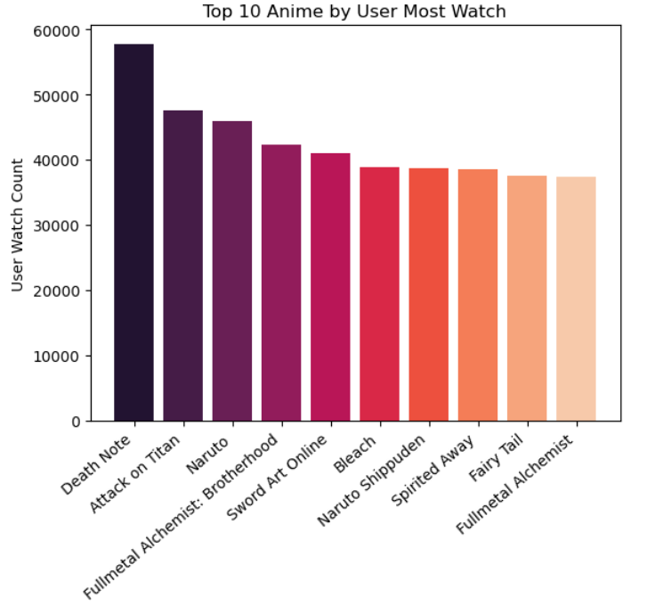
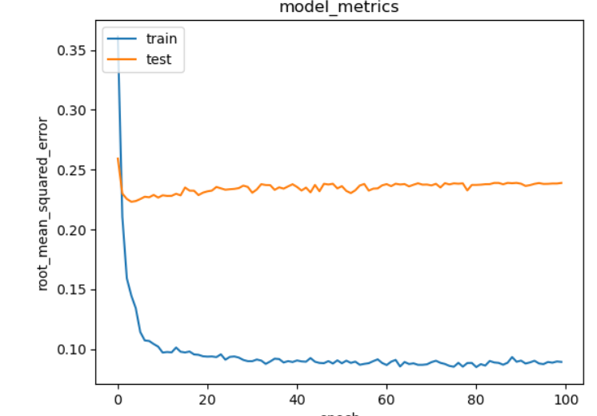

# Laporan Proyek Machine Learning - Sukron Chafidhi

# Project Overview


Anime adalah istilah yang digunakan oleh orang Jepang untuk merujuk pada segala bentuk animasi, tanpa memandang asal negaranya (Poitras, 2015). Dari tahun 2013 hingga 2018, industri anime mengalami pertumbuhan pesat dengan ukuran pasar rata-rata sekitar 2 triliun yen. Pada tahun 2018, pasar luar negeri bahkan melebihi 1 triliun yen, atau sekitar 46,3% dari total ukuran pasar animasi Jepang. Dengan pertumbuhan ini setiap tahunnya, akan ada banyak karya anime baru yang diproduksi untuk dinikmati oleh pengguna. Namun, keberagaman besar dalam karya anime ini dapat membuat pengguna kewalahan dalam mencari anime yang sesuai dengan preferensi mereka (Nuurshadieq & Wibowo, 2020). Salah satu cara untuk mengatasi masalah ini adalah menggunakan sistem rekomendasi yang memungkinkan pengguna dipasangkan dengan karya-karya yang sesuai dengan preferensi mereka secara otomatis, tanpa perlu mencari secara manual (Nuurshadieq & Wibowo, 2020).

# Business Understanding
## Problem Statements
•	Bagaimana cara merekomendasikan anime berdasarkan riwayat user?

•	Bagaimana cara merekomendasikan anime berdasarkan penilaian user lain?


## Goals
•	Membuat Sistem Rekomendasi anime berdasarkan riwayat user

•	Membuat Sistem Rekomendasi anime berdasarkan penilaian user lain


## Solution Approach
Solusi yang diajukan yaitu dengan menggunakan 2 algoritma machine learning untuk sistem rekomendasi yaitu:

•	Content Based Filtering: Sistem rekomendasi berbasis konten bertujuan untuk merekomendasikan item yang memiliki kesamaan dengan item yang disukai oleh pengguna pada masa lalu. Pendekatan umumnya adalah menggambarkan baik pengguna maupun item dalam ruang fitur yang sama. Setelah itu, skor kesamaan dihitung antara pengguna dan item. Rekomendasi dibuat berdasarkan skor kesamaan antara pengguna dan semua item. Metode Content-based Filtering biasanya memberikan hasil yang baik ketika pengguna memiliki banyak catatan historis untuk pembelajaran (Lu et al., 2015). Catatan historis user yang digunakan adalah berdasarkan tags dari anime yang telah dilihat oleh user.

•	Collaborative Filtering: Collaborative Filtering merupakan pendekatan yang digunakan untuk secara otomatis memprediksi minat pengguna dengan mengumpulkan informasi minat dari banyak pengguna terkait (kolaborasi). Beberapa hasil terbaik dicapai dengan menerapkan teknik faktorisasi matriks. Metode Collaborative Filtering umumnya dipilih ketika catatan historis untuk pelatihan terbatas atau tidak banyak (Lu et al., 2015). Collaborative Filtering yang digunakan berbasis rating yang didapatkan dari user dengan syarat telah me-rating sekurang-kurangnya 10 anime.


# Data Understanding
Data atau datasets yang digunakan pada proyek Machine Learning ini adalah data Anime-Planet Recommendation Database 2020 yang bisa diakses di link berikut ini [kaggle]( https://www.kaggle.com/datasets/hernan4444/animeplanet-recommendation-database-2020).

Variabel-variabel yang terdapat pada dataset adalah sebagai berikut:

## animelist.csv
Dataset ini berisi daftar semua anime yang terdaftar oleh pengguna berserta skor, status menonton, dan jumlah episode yang telah ditonton oleh pengguna. Terdapat 20 juta baris data, 16.745 anime berbeda, dan 74.129 pengguna berbeda dalam dataset ini. File tersebut memiliki kolom-kolom berikut:
1. user_id: ID pengguna yang dihasilkan secara acak dan tidak dapat diidentifikasi.
2. anime_id: ID Anime-planet dari anime tersebut. (contoh: 1).
3. score: Nilai antara 1 hingga 5 yang diberikan oleh pengguna dalam skala 0.5. Nilai 0 jika pengguna tidak memberikan penilaian. (contoh: 3.5).
4. watching_status: ID status dari anime tersebut dalam daftar anime pengguna. (contoh: 2).
5. watched_episodes: Jumlah episode yang telah ditonton oleh pengguna. (contoh: 24).

## watching_status.csv
Berikut adalah deskripsi dari setiap kemungkinan status dalam kolom "watching_status" dalam file animelist.csv:

•	Watched: Sudah Ditonton

•	Watching: Sedang Ditonton

•	Dropped: Dihentikan (Tidak Dilanjutkan)

•	Want to Watch: Ingin Ditonton

•	Stalled: Mandek (Ditunda)

•	Won't Watch: Tidak Akan Ditonton


## rating_complete.csv
Ini adalah subset dari animelist.csv. Dataset ini hanya mempertimbangkan anime-anime yang telah ditonton secara lengkap oleh pengguna (watching_status==1) dan diberi penilaian (score!=0). Dataset ini berisi 8 juta penilaian yang diberikan untuk 15.681 anime oleh 68.199 pengguna. File ini memiliki kolom-kolom berikut: [daftar kolom-kolom dataset akan diisi di sini].
Berikut adalah terjemahan dari kolom-kolom dataset:

- user_id: ID pengguna yang dihasilkan secara acak dan tidak dapat diidentifikasi.
- anime_id: ID Anime-planet dari anime tersebut. (contoh: 1).
- rating: Nilai penilaian yang diberikan oleh pengguna untuk anime ini.


## anime_recommendations.csv
File ini berisi daftar semua anime yang direkomendasikan berdasarkan satu anime tertentu. Informasi ini diambil dari tab "recommendation" (misalnya: https://www.anime-planet.com/anime/the-saints-magic-power-is-omnipotent/recommendations ). File ini memiliki kolom-kolom berikut:

- Anime: ID Anime Planet dari anime tertentu. (contoh: 1).
- Recommendation: ID Anime Planet dari anime yang direkomendasikan. (contoh: 1).
- Agree Votes: jumlah pengguna yang setuju dengan rekomendasi tersebut.


## anime.csv
File ini berisi informasi umum dari setiap anime (16.621 anime berbeda) seperti Tag, tipe, studio, sinopsis, dan lain-lain. File ini memiliki kolom-kolom berikut:
 
- Anime-PlanetID: ID Anime Planet dari anime tersebut. (contoh: 1).
- Nama: nama lengkap dari anime tersebut. (contoh: FLCL)
- Nama Alternatif: cara lain untuk menyebut anime tersebut. (contoh: Furi Kuri)
- Skor Rating: skor rata-rata dari anime tersebut yang diberikan oleh seluruh pengguna di database Anime Planet. (contoh: 8.78)
- Jumlah Suara: jumlah pengguna yang memberikan skor untuk anime tersebut. (contoh: 1241)
- Tag: daftar tag yang dipisahkan dengan koma untuk anime tersebut. (contoh: Comedy, Mecha, Sci Fi, Outer Space, Original Work)
- Peringatan Konten: daftar tag peringatan konten yang dipisahkan dengan koma. (contoh: Explicit Violence, Mature Themes, Nudity)
- Tipe: TV, film, OVA, dll. (contoh: TV).
- Episode: jumlah episode. (contoh: 26)
- Selesai: Benar (True) jika anime tersebut sudah selesai ketika data diambil, Salah (False) jika anime tersebut masih berlanjut saat itu.
- Durasi: durasi anime dalam menit (contoh: 60)
- Tahun Mulai: tahun ketika anime mulai ditayangkan. (contoh: 2016)
- Tahun Selesai: tahun ketika anime selesai ditayangkan. (contoh: 2017)
- Musim: musim dan tahun rilis (contoh: Fall 2000)
- Studio: daftar studio yang dipisahkan dengan koma (contoh: Sunrise)
- Sinopsis: sinopsis dari anime tersebut.
- URL: tautan ke halaman utama anime di Anime Planet (contoh: https://www.anime-planet.com/anime/vandread)

Gambar 1. Anime paling banyak dilihat


Berdasarkan Gambar 1 dapat dilihat jika anime dengan jumlah view paling banyak adalah Death Note, Attack On Titan dan Naruto. View ini sendiri dihitung dengan menjumlahkan total dari nama anime dari variabel anime, sehingga dari satu user dimungkinkan berkontribusi lebih dari 1 kali view.

## EDA – Univariate
Variabel-variabel pada Animeplanet Recommendation dataset adalah sebagai berikut:

•	animelist: list anime yang terdaftar user
Terdapat 4 variabel integer (user_id, anime_id, watching_status, watched_episodes)  dan 1 variabel float (rating). Banyak user yang mendaftarkan anime 74129 dan banyak anime didaftarkan 16745.

•	watching_status: kategori untuk status anime ditonton
Terdapat 1 variabel integer (status)  dan 1 variabel object (_description) Banyak data:  6 dan Jenis Status:  ['Watched' 'Watching' 'Dropped' 'Want to Watch' 'Stalled' "Won't Watch"].

•	rating_complete: list anime yang telah ditonton hingga selesai dan memiliki rating
rating minimal 0.5 dan maksimal 5.0, sementara rata-rata rating anime bernilai 3.82. Jumlah user unik:  68199, Jumlah anime unik:  15681 dan Jumlah anime ber-rating  8765945.

•	anime: informasi umum untuk setiap anime
Terdapat 16621 anime, dengan jumlah 10782 tags unik. Terdapat 17 kolom pada tabel, dengan 1 kolom bertipe int64 (anime_planetid), 1 kolom bertipe bool (finished) dan 15 lainnya bertipe object.

# Data Preparation
## Seleksi fitur
Menyeleksi fitur mana saja yang akan digunakan pada pelatihan nanti.
Kolom yang dipilih ['anime_planetid', 'name', 'rating_score', 'tags'] dari variabel anime dan kolom [‘user_id’, ‘anime_id’, ‘rating’] dari variabel animelist_data.

## Gabungkan fitur
Menggabungkan variabel anime_data dan animelist_data dengan primary key anime_planetid dan foreign key anime_id. Setelah penggabungan, primary key dapat dihapus karena sudah ada foreign key. Hasil dari penggabungan seperti pada Tabel 1.

Tabel 1. Hasil penggabungan fitur

|   | anime_id |                 name | rating_score |                                              tags | user_id | rating |   |
|--:|---------:|---------------------:|-------------:|--------------------------------------------------:|--------:|-------:|---|
|   | 10       | The Prince of Tennis | 4.037        | Comedy, Drama, Shounen, Sports, Tennis, Based ... | 7       | 0.0    |   |
|   | 10       | The Prince of Tennis | 4.037        | Comedy, Drama, Shounen, Sports, Tennis, Based ... | 8       | 3.5    |   |
|   | 10       | The Prince of Tennis | 4.037        | Comedy, Drama, Shounen, Sports, Tennis, Based ... | 22      | 0.0    |   |
|   | 10       | The Prince of Tennis | 4.037        | Comedy, Drama, Shounen, Sports, Tennis, Based ... | 34      | 4.0    |   |
|   | 10       | The Prince of Tennis | 4.037        | Comedy, Drama, Shounen, Sports, Tennis, Based ... | 37      | 3.0    |   |


## Membersihkan Teks
Tugas ini berfungsi untuk menghilangkan karakter khusus dari teks sehingga teks pada data lebih ter format. Data hasil keluaran proses ini berjumlah 20840693 baris x 6 kolom.

## Menghapus data duplikat
Proses ini bertugas untuk mengahpus id anime yang duplikat, proses ini menghasilkan 16621 baris × 6 kolom, seperti Tabel 2.

Tabel 2. Hasil setelah pembersihan data suplikat

| anime_id |                      name                     | rating_score |                        tags                       | user_id | rating |
|:--------:|:---------------------------------------------:|:------------:|:-------------------------------------------------:|:-------:|:------:|
| 10       | The Prince of Tennis                          | 4.037        | Comedy, Drama, Shounen, Sports, Tennis, Based ... | 7       | 0.0    |
| 100      | Neon Genesis Evangelion                       | 4.248        | Drama, Mecha, Sci Fi, Conspiracy, Kaijuu, Lone... | 5       | 0.0    |
| 1000     | Full Metal Panic! The Second Raid             | 4.35         | Action, Comedy, Mecha, Sci Fi, Shounen, Milita... | 1       | 3.5    |
| 10000    | 22/7: Shampoo no Nioi ga Shita                | 2.8          | Idols, School Life, CG Animation                  | 68      | 0.0    |
| 10001    | Oshiri Tantei: Puputto Fumutto Kaiketsu Dance | 1.271        | Family Friendly                                   | 1635    | 0.0    |


## Replace koma - Content Based Filtering
Proses tersebut dilakukan pada data untuk Content Based Filtering yang bertugas mengganti semua tanda koma pada kolom tags dengan spasi dan disimpan pada variabel tags_combined.

## Scalling Rating - Content Based Filtering
Berguna untuk men-skala kan data rating menjadi bernilai antara 0-1.

## Encoding - Content Based Filtering
Menyandikan user_id dan anime_id kedalam indeks integer, kemudian memetakannya kedalam dataframe untuk mempermudah testing.

## Mengubah letak data secara random - Content Based Filtering
Berguna untuk mendistribusikan secara acak dan mencegah bias sebelum data dibagi ke train dan test.

## Train Test Split - Content Based Filtering
Membagi data menjadi data test dan data train dengan rasio 20:80. Data train akan digunakan melatih model, sedangkan data test digunakan untuk menguji model.

# Modeling and Result
## Content Based Filtering
Content based filtering menggunakan informasi tentang beberapa item dari pengguna untuk merekomendasikan item lain yang serupa. Pada kasus ini, algoritma bekerja dengan cara mendapatkan tags dari anime yang dipilih atau pernah dilihat oleh pengguna, kemudian sistem akan merekomendasikan beberapa anime lain dengan tags yang serupa menggunakan Cosine Similarity yang bertugas mengukur kesamaan antara vektor dari data referensi (masukan) dan anime lain dengan tags yang serupa (yang akan menjadi output).

Cosine similarity adalah metode untuk mengukur sejauh mana dua vektor serupa dan menentukan apakah arah kedua vektor tersebut sama. Ini melibatkan perhitungan sudut cosinus antara dua vektor. Semakin kecil sudut cosinus, semakin tinggi nilai cosine similarity, yang menandakan tingkat kesamaan yang lebih tinggi antara kedua vektor (Mondi et al., 2019).

cosine similarity = $\sum_{i=1}^n * A_i B_i \over \sum_{i=1}^n * A_i^2 * \sum_{i=1}^n * B_i^2$


•	Data yang digunakan metode ini adalah dari tags

•	Hasil top 5 Recommendation terhadap nama anime ‘THE CHARM PARK: Timeless’ pada Tabel 3.
```
anime_recommendations('THE CHARM PARK: Timeless')
```

Tabel 3. Hasil rekomendasi cosine similarity
|   	|              name             	|                        tags                       	|
|--:	|:-----------------------------:	|:-------------------------------------------------:	|
| 0 	| Furiko                        	| Drama, Romance, Aging, Black and White, Shorts    	|
| 1 	| Best Care Group               	| Slice of Life, Aging, No Dialogue, Promotional... 	|
| 2 	| The Sakuramoto Broom Workshop 	| Drama, Aging, No Dialogue, Shorts, Stop Motion... 	|
| 3 	| Walls                         	| Abstract                                          	|
| 4 	| Canigou: Tape                 	| Abstract                                          	|


•	Kelebihan: Sistem ini mampu memberikan rekomendasi baru kepada pengguna berdasarkan deskripsi konten dari item yang sebelumnya telah mendapatkan rating tinggi dari pengguna (Devi, 2015).

•	Kelemahan: Keterbatasan rekomendasi hanya pada item yang mirip mengakibatkan ketiadaan kesempatan untuk menemukan item yang tak terduga (Mondi et al., 2019).


## Collaborative Based Filtering

Collaborative Filtering adalah proses penilaian item dengan memanfaatkan pandangan orang lain. Walaupun istilah Collaborative Filtering (CF) baru muncul dalam dekade terakhir, konsep ini telah lama ada dalam praktik berbagi pendapat antar manusia selama berabad-abad. Sistem collaborative filtering menciptakan prediksi atau rekomendasi untuk pengguna tertentu terkait satu atau lebih item. Item tersebut dapat berupa apa saja yang dapat dinilai oleh manusia, seperti seni, buku, CD, artikel jurnal, atau tujuan liburan (Schafer et al., 2007).

Metode Collaborative Filtering pada kasus ini bekerja dengan cara menghitung skor kecocokan antara  anime dan user dengan teknik embedding. Langkah pertama adalah embedding anime dan user, dilanjutkan dengan perkalian dot produc antara embedding user dan embedding anime, dengan skor kecocokan antara 0 hingga 1 dengan aktivasi Sigmoid, loss function Binary Crossentropy, Optimizer Adam dan metrik RMSE.

•	Data yang digunakan metode ini adalah nilai rating dari semua user yang minimal telah me-rating 10 anime
•	Top 5 Recommendation yang dihasilkan untuk user_id 21 seperti Tabel 4.

```

get_recommendations(21)

```

Tabel 4. Hasil rekomendasi Collaborative Filtering

|                        name                       	| pred_rating 	|                        tags                       	|                     sypnopsis                     	|   	|
|:-------------------------------------------------:	|:-----------:	|:-------------------------------------------------:	|:-------------------------------------------------:	|:-:	|
| Ultraviolet: Code 044                             	| 0.381287    	| Action, Sci Fi, Vampires, Based on a Comic Book   	| In a future where genetic modification is comm... 	|   	|
| Black Jack: Karte NG Extras                       	| 0.371905    	| Comedy, Shounen, Doctors, Gag, Medical, Slapst... 	| No synopsis yet - check back soon!                	|   	|
| One Piece Movie 9: Episode of Chopper - The Mi... 	| 0.371399    	| Action, Adventure, Comedy, Shounen, Island, Pi... 	| When Nami suddenly comes down with a fever, Lu... 	|   	|
| Wolf Guy                                          	| 0.362220    	| Action, Sci Fi, Seinen, Animal Transformation,... 	| No synopsis yet - check back soon!                	|   	|
| Queen's Blade: Beautiful Warriors                 	| 0.358461    	| Action, Ecchi, Fantasy                            	| The Queen's Blade tournament may be over, but ... 	|   	|


•	Kelebihan: dapat menghasilkan rekomendasi yang berkualitas baik (Handrico, 2012)

•	Kelemahan: Semakin banyak pengguna sistem, kompleksitas perhitungannya akan bertambah, dan sebagai akibatnya, sistem perekomendasiannya akan memerlukan waktu lebih lama (Handrico, 2012).


# Evaluation

## Content Based Filtering - Precision
Referensi untuk masukan rekomender

| anime_id 	|  name 	|             rating_score 	|  tags 	|         user_id 	| rating 	|     	|
|---------:	|------:	|-------------------------:	|------:	|----------------:	|-------:	|-----	|
|  2269159 	| 12689 	| THE CHARM PARK: Timeless 	| 2.529 	| Abstract, Aging 	| 1635   	| 0.0 	|


Hasil rekomendasi

|   	|              name             	|                        tags                       	|
|--:	|:-----------------------------:	|:-------------------------------------------------:	|
| 0 	| Furiko                        	| Drama, Romance, Aging, Black and White, Shorts    	|
| 1 	| Best Care Group               	| Slice of Life, Aging, No Dialogue, Promotional... 	|
| 2 	| The Sakuramoto Broom Workshop 	| Drama, Aging, No Dialogue, Shorts, Stop Motion... 	|
| 3 	| Walls                         	| Abstract                                          	|
| 4 	| Canigou: Tape                 	| Abstract                                          	|

rekomendasi dianggap benar jika memiliki salah satu tags dari tags data referensi (yang diberi rekomendasi) sehingga dapat dihitung nilai precision nya,

$$
Precision = \frac{rekomendasi yang relevan}{jumlah yang direkomendasikan}
$$

$$
Precision = \frac{5}{5}
$$

Sehingga didapatkan nilai presisinya 100%


## Collaborative Filtering - Root Mean Squared Error (RMSE)
Root mean square error (RMSE) adalah parameter yang digunakan untuk mengevaluasi tingkat ketepatan pengukuran terhadap nilai sebenarnya atau nilai yang dianggap benar. Semakin kecil nilai RMSE, semakin mendekati keakuratan pengklasteran data (Febrianti et al., 2016). Persamaan RMSE sebagai berikut.
$$
RMSE = \sqrt{\frac{\left(x^{'}-x\right)^{2}+\left(y^{'} - y \right )^{2}}{n}}
$$

Ket.
(x’, y’) = nilai perhitungan
(x, y) = nilai asli
n =jumlah data



Gambar 2. Loss train and test model metrics

Berdasarkan Gambar 2 dapat disimpulkan bahwa model mengalami overfitting, karena nilai train rmse semakin mengecil sementara nilai test rmse masih stabil di pertengangan kurva. Hal ini dapat terjadi salah satunya karena sedikitnya dataset yang digunakan ataupun karena kualitas data yang kurang memadai.

# Kesimpulan
•	Pembuatan Sistem Rekomendasi anime berdasarkan riwayat user dapat dilakukan menggunakan Content Based Filtering dengan algoritma cosine similarity yang mengukur sejauh mana dua vektor serupa dan menentukan apakah arah kedua vektor tersebut sama (menggunakan tags). Model yang telah dibuat memiliki performa yang bagus dengan nilai precision 100%. 

•	Pembuatan Sistem Rekomendasi anime berdasarkan penilaian user lain dapat dilakukan menggunakan Collaborative Filtering, dengan cara membuat fungsi RecommenderNet dengan target adalah rating dari anime yang diberikan oleh user. Model yang telah dibuat memiliki performa yang cukup bagus dengan nilai RMSE<0.1 untuk data train, namun untuk data test RMSE berkisar antara 0.25, sehingga ada kemungkinan model dapat mengalami overfitting.


# Reference

Devi, A. A. P. (2015). Rancang Bangun Recommender System dengan Menggunakan Metode Collaborative Filtering untuk. JUISI, 01(02).

Febrianti, F., Hafiyushole, M., & Asyhar, A. H. (2016). Perbandingan Pengklusteran data iris menggunakan metode k-means dan fuzzy c-means. Jurnal Matematika "MANTIK , 2(1), 7–13.

Handrico, A. (2012). Sistem rekomendasi buku perpustakaan fakultas sains dan teknologi dengan metode collaborative filtering. UNIVERSITAS ISLAM NEGERI SULTAN SYARIEF KASIM RIAU.

Lu, Z., Dou, Z., Lian, J., Xie, X., & Yang, Q. (2015). Content-Based Collaborative Filtering for News Topic Recommendation. Proceedings of the AAAI Conference on Artificial Intelligence, 29(1). https://doi.org/10.1609/aaai.v29i1.9183

Mondi, R. H., Wijayanto, A., & Winarno. (2019). Recommendation System With Content-Based Filtering Method For Culinary Tourism In Mangan Application. ITSMART: Jurnal Teknologi Dan Informasi, 8.

Nuurshadieq, & Wibowo, A. T. (2020). Leveraging Side Information to Anime Recommender System using Deep learning. 2020 3rd International Seminar on Research of Information Technology and Intelligent Systems (ISRITI), 62–67. https://doi.org/10.1109/ISRITI51436.2020.9315363

Poitras, G. (2015). Japanese Visual Culture: Explorations in the World of Manga and Anime. Routledge.

Schafer, J. Ben, Frankowski, D., Herlocker, J., & Sen, S. (2007). Collaborative Filtering Recommender Systems. In The Adaptive Web (pp. 291–324). Springer Berlin Heidelberg. https://doi.org/10.1007/978-3-540-72079-9_9
 
